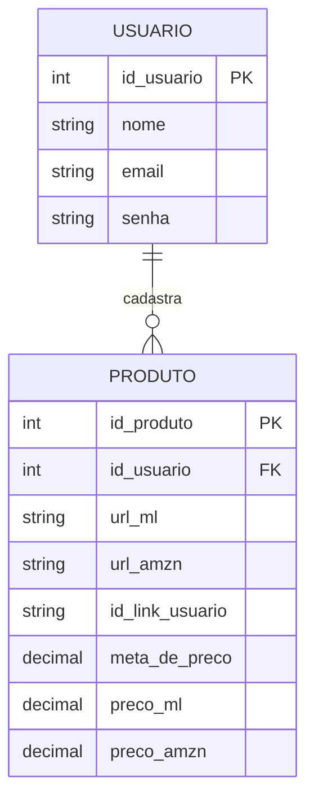

# 🛠️ Especificação Técnica (Tech Spec) - PriceWatcher

Este documento detalha a arquitetura técnica, o modelo de dados e os contratos de API simulada (via JSON Server) necessários para o funcionamento do sistema PriceWatcher.

## 1. Modelo de Dados (Diagrama ER)

Abaixo está o Diagrama Entidade-Relacionamento (DER) que representa a estrutura do nosso "banco de dados" (`db.json`) e como as informações se conectam.



## 2. Dicionário de Dados

Breve explicação das tabelas principais:

- **usuarios:** armazena os usuários do sistema.
  - `id_usuario`: identificador único do usuário.
  - `nome`: nome completo do usuário.
  - `email`: e-mail de login (único).
  - `senha`: senha do usuário.

- **produtos:** tabela de produtos cadastrados pelos usuários para monitoramento.
  - `id_produto`: identificador único do produto.
  - `id_usuario`: chave estrangeira referenciando o usuário dono do produto.
  - `url_ml`: link do produto no Mercado Livre.
  - `url_amzn`: link do produto na Amazon.
  - `id_link_usuario`: identificador customizado do link (tracking ou afiliado).
  - `meta_de_preco`: preço alvo definido pelo usuário.
  - `preco_ml`: preço atual coletado do Mercado Livre.
  - `preco_amzn`: preço atual coletado da Amazon.

## 3. Rotas da API (JSON Server)

A aplicação consome uma API simulada via JSON Server. Abaixo os principais endpoints:

**Usuários**
- `GET /usuarios` → Lista todos os usuários
- `POST /usuarios` → Cria um novo usuário
- `GET /usuarios?email=...&senha=...` → Autenticação

**Produtos**
- `GET /produtos` → Lista todos os produtos
- `GET /produtos?id_usuario=...` → Lista produtos de um usuário
- `GET /produtos/:id` → Retorna um produto específico
- `POST /produtos` → Cadastra um novo produto
- `PATCH /produtos/:id` → Atualiza preços ou meta
- `DELETE /produtos/:id` → Remove um produto

> **Observação:** No MVP, as ações de atualização de preço, notificação e alertas podem ser feitas localmente no front-end combinando os recursos acima.

## 4. Exemplo `db.json`

Este é um exemplo de estrutura do banco de dados simulado. Serve para inicializar o JSON Server e para testes iniciais.

```json
{
  "usuarios": [
    {
      "id_usuario": 1,
      "nome": "Ana Souza",
      "email": "ana@exemplo.com",
      "senha": "senha_mock"
    }
  ],
  "produtos": [
    {
      "id_produto": 1,
      "id_usuario": 1,
      "url_ml": "https://mercadolivre.com/prod/123",
      "url_amzn": "https://amazon.com/prod/123",
      "id_link_usuario": "ref_ana_001",
      "meta_de_preco": 150.00,
      "preco_ml": 199.90,
      "preco_amzn": 189.90
    }
  ]
}
```

## 5. Fluxo de Dados e Regras de Negócio

1. Usuário realiza cadastro/login.
2. Usuário cadastra um produto informando URLs e preço alvo.
3. Sistema armazena o produto vinculado ao usuário.
4. Um processo (manual ou automatizado) atualiza `preco_ml` e `preco_amzn`.
5. O front-end compara `preco_ml` ou `preco_amzn` com `meta_de_preco`.
6. Caso o preço atual seja menor ou igual à meta, o sistema pode:
   - Exibir alerta visual
   - Destacar o produto na interface

## 6. Considerações para Implementação

- **Autenticação simples via:**
  - `GET /usuarios?email=...&senha=...`
  - Persistência do usuário via `localStorage`

- **Atualização de preços:**
  - Atualizar via `PATCH /produtos/:id`
  - Pode ser feito por script manual ou simulação no front-end

- **Monitoramento de preço — lógica no front-end:**

```js
if (preco_ml <= meta_de_preco || preco_amzn <= meta_de_preco) {
  // disparar alerta
}
```

## 7. Testes e Qualidade

- Testar cadastro e login de usuários
- Testar CRUD de produtos
- Validar vínculo correto entre usuário e produto
- Testar atualização de preços
- Testar comparação com meta de preço
- Testar responsividade da interface

---

**Última atualização:** Abril de 2026
**Versão:** 2.0
**Status:** Atualizado conforme novo modelo ER
