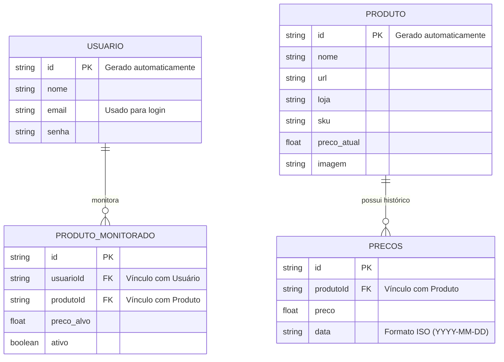

# 🛠️ Especificação Técnica (Tech Spec) - PriceWatcher

Este documento detalha a arquitetura técnica, o modelo de dados e os contratos de API simulada (via JSON Server) necessários para o funcionamento do sistema PriceWatcher.

## 1. Modelo de Dados (Diagrama ER)

Abaixo está o Diagrama Entidade-Relacionamento (DER) que representa a estrutura do nosso "banco de dados" (`db.json`) e como as informações se conectam.



## 2. Dicionário de Dados

Breve explicação das tabelas principais:

- **usuarios:** cadastra as contas de login.
  - id: identificador único gerado pelo JSON Server.
  - email: chave de acesso do usuário (única via validação de front-end/back-end).
  - senha: armazenada no front-end de forma segura (hash se houver backend real).

- **produtos:** catálogo de produtos monitoráveis.
  - preco_atual: última cotação disponível.
  - url: link direto para o produto na loja.
  - loja: nome do marketplace.

- **produto_monitorado:** relação entre usuário e produto selecionado para monitoramento.
  - usuarioId: chave estrangeira para a coleção `usuarios`.
  - produtoId: chave estrangeira para a coleção `produtos`.
  - preco_alvo: preço máximo definido pelo usuário para notificação.
  - ativo: indica se o monitoramento está ativo.

- **precos:** histórico temporal de preços do produto.
  - produtoId: chave estrangeira para a coleção `produtos`.
  - preco: valor da cotação em determinada data.
  - data: marcação para geração do gráfico.

## 3. Rotas da API (JSON Server)

A aplicação consome a API local simulada pelo JSON Server. Abaixo os principais endpoints:

- `GET /usuarios` - Retorna a lista de usuários.
- `POST /usuarios` - Cadastra um novo usuário.
- `GET /usuarios?email=...` - Autenticação (validação de credenciais).
- `GET /produtos` - Retorna lista de todos os produtos monitoráveis.
- `GET /produtos/:id` - Retorna dados de um produto específico.
- `POST /produtos` - Cria um produto (se houver backend de scraping).
- `GET /produto_monitorado?usuarioId=...` - Retorna produtos monitorados por usuário.
- `POST /produto_monitorado` - Adiciona um produto ao monitoramento.
- `PATCH /produto_monitorado/:id` - Atualiza preço-alvo ou ativa/desativa monitoramento.
- `DELETE /produto_monitorado/:id` - Remove produto do monitoramento.
- `GET /precos?produtoId=...` - Retorna histórico de preços por produto.
- `POST /precos` - Insere nova cotação de preço.

> Observação: No MVP, as ações de atualização de preço, notificação e gráfico podem ser feitas localmente no front-end combinando os recursos acima.

## 4. Exemplo `db.json`

Este é um exemplo de estrutura do banco de dados simulado. Sirve para inicializar o JSON Server e para testes iniciais.

```json
{
  "usuarios": [
    {
      "id": "1",
      "nome": "Ana Souza",
      "email": "ana@exemplo.com",
      "senha": "senha_mock",
      "createdAt": "2026-03-23T14:00:00Z"
    }
  ],
  "produtos": [
    {
      "id": "1",
      "nome": "Fone de Ouvido Bluetooth",
      "url": "https://lojax.com/prod/123",
      "loja": "Lojax",
      "sku": "ABC123",
      "preco_atual": 199.90,
      "imagem": "https://lojax.com/prod/123/image.jpg"
    }
  ],
  "produto_monitorado": [
    {
      "id": "1",
      "usuarioId": "1",
      "produtoId": "1",
      "preco_alvo": 149.99,
      "ativo": true
    }
  ],
  "precos": [
    {
      "id": "1",
      "produtoId": "1",
      "preco": 219.90,
      "data": "2026-03-01"
    },
    {
      "id": "2",
      "produtoId": "1",
      "preco": 205.00,
      "data": "2026-03-10"
    },
    {
      "id": "3",
      "produtoId": "1",
      "preco": 199.90,
      "data": "2026-03-23"
    }
  ]
}
```

## 5. Fluxo de Dados e Regras de Negócio

1. Usuário faz login com email/senha.
2. Busca produtos ou acessa painel de monitoramento.
3. Adiciona produto ao monitoramento com um `preco_alvo`.
4. Serviço agendado/ataque simulado (MVP manual) atualiza a tabela `precos` periodicamente.
5. Na leitura da lista de produtos monitorados, o front-end calcula o status e dispara alertas quando `preco_atual <= preco_alvo`.
6. Dados históricos são plotados a partir das entradas de `precos`.

## 6. Considerações para Implementação

- Autenticação:
  - No MVP, método simples com `GET /usuarios?email=...&senha=...`.
  - Persistência do usuário via `localStorage` ou `sessionStorage`.

- Atualização de `preco_atual`:
  - Pode ser feita com `PATCH /produtos/:id` após ingestão de novo valor.
  - Sempre criar novo registro em `precos` para histórico.

- Notificação de preço-alvo:
  - Pode ser calculada no cliente (comparação entre produto e preço alvo).
  - Salvar último estado de alerta para evitar repetição.

## 7. Testes e Qualidade

- Testar rota de cadastro e login com diversas combinações de e-mail/senha.
- Testar criação e exclusão de `produto_monitorado`.
- Validar histórico de preços e geração de gráfico.
- Testar UX responsivo (mobile/tablet/desktop).
- Testar comportamento quando não há internet (modo offline parcial + dados em localStorage).

---

**Última atualização:** Março de 2026  
**Versão:** 1.0  
**Status:** Em desenvolvimento
