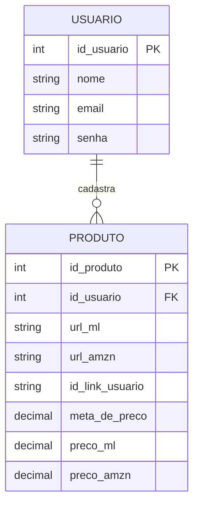

# 🛠️ Especificação Técnica (Tech Spec) - PriceWatcher

Este documento detalha a arquitetura técnica, o modelo de dados e os contratos de API simulada (via JSON Server) necessários para o funcionamento do sistema PriceWatcher.

---

## 0. Stack de Tecnologias e Versões Exatas

> ⚠️ **Instrução para desenvolvedores e agentes de IA:** utilize **exatamente** as versões listadas abaixo. Não atualize dependências sem revisão explícita, pois mudanças de versão podem quebrar compatibilidade entre os módulos do projeto.

### 🌐 Frontend

| Tecnologia      | Versão     | Forma de uso                                                  |
| --------------- | ---------- | ------------------------------------------------------------- |
| HTML            | 5          | Markup semântico                                              |
| CSS             | 3          | Estilização base + customizações                              |
| JavaScript      | ES6+       | Lógica de negócio e DOM                                       |
| Bootstrap       | **5.3.3**  | Framework CSS — `npm install bootstrap@5.3.3`                 |
| Bootstrap Icons | **1.11.3** | Ícones — `npm install bootstrap-icons@1.11.3`                 |
| jQuery          | **3.7.1**  | Utilitários DOM — `npm install jquery@3.7.1`                  |
| Chart.js        | **4.4.3**  | Gráficos de histórico de preço — `npm install chart.js@4.4.3` |

### ⚙️ Backend Simulado (API Fake)

| Tecnologia  | Versão                    | Comando de inicialização         |
| ----------- | ------------------------- | -------------------------------- |
| Node.js     | **v20.x (LTS)**           | Ambiente de execução             |
| npm         | Incluído no Node.js v20.x | Gerenciador de pacotes           |
| JSON Server | **0.17.4**                | `npm install json-server@0.17.4` |

> **Iniciar o servidor:** `npx json-server --watch db.json --port 3001`

### 🔌 APIs Públicas Externas

| API                                     | Versão   | Autenticação               |
| --------------------------------------- | -------- | -------------------------- |
| Mercado Livre API                       | **v1**   | OAuth 2.0 (token gratuito) |
| Amazon Product Advertising API (PA API) | **v5.0** | AWS Signature v4           |

### 🧰 Ferramentas de Desenvolvimento

| Ferramenta                     | Versão / Observação                   |
| ------------------------------ | ------------------------------------- |
| Git                            | Qualquer versão estável               |
| VS Code (recomendado)          | —                                     |
| Extensão Live Server (VS Code) | Para servir o `index.html` localmente |

---

## 1. Modelo de Dados (Diagrama ER)

Abaixo está o Diagrama Entidade-Relacionamento (DER) que representa a estrutura do nosso "banco de dados" (`db.json`) e como as informações se conectam.



---

## 2. Dicionário de Dados

Breve explicação das tabelas principais:

- **usuarios:** armazena os usuários do sistema.
  - `id_usuario`: identificador único do usuário.
  - `nome`: nome completo do usuário.
  - `email`: e-mail de login (único).
  - `senha`: senha do usuário.

- **produtos:** tabela de produtos cadastrados pelos usuários para monitoramento.
  - `id_produto`: identificador único do produto.
  - `id_usuario`: chave estrangeira referenciando o usuário dono do produto.
  - `url_ml`: link do produto no Mercado Livre.
  - `url_amzn`: link do produto na Amazon.
  - `id_link_usuario`: identificador customizado do link (tracking ou afiliado).
  - `meta_de_preco`: preço alvo definido pelo usuário.
  - `preco_ml`: preço atual coletado do Mercado Livre.
  - `preco_amzn`: preço atual coletado da Amazon.

---

## 3. Rotas da API (JSON Server)

A aplicação consome uma API simulada via JSON Server. Abaixo os principais endpoints:

**Usuários**
- `GET /usuarios` → Lista todos os usuários
- `POST /usuarios` → Cria um novo usuário
- `GET /usuarios?email=...&senha=...` → Autenticação

**Produtos**
- `GET /produtos` → Lista todos os produtos
- `GET /produtos?id_usuario=...` → Lista produtos de um usuário
- `GET /produtos/:id` → Retorna um produto específico
- `POST /produtos` → Cadastra um novo produto
- `PATCH /produtos/:id` → Atualiza preços ou meta
- `DELETE /produtos/:id` → Remove um produto

> **Observação:** No MVP, as ações de atualização de preço, notificação e alertas podem ser feitas localmente no front-end combinando os recursos acima.

---

## 4. Exemplo `db.json`

Este é um exemplo de estrutura do banco de dados simulado. Serve para inicializar o JSON Server e para testes iniciais.

```json
{
  "usuarios": [
    {
      "id_usuario": 1,
      "nome": "Ana Souza",
      "email": "ana@exemplo.com",
      "senha": "senha_mock"
    }
  ],
  "produtos": [
    {
      "id_produto": 1,
      "id_usuario": 1,
      "url_ml": "https://mercadolivre.com/prod/123",
      "url_amzn": "https://amazon.com/prod/123",
      "id_link_usuario": "ref_ana_001",
      "meta_de_preco": 150.00,
      "preco_ml": 199.90,
      "preco_amzn": 189.90
    }
  ]
}
```

---

## 5. Fluxo de Dados e Regras de Negócio

1. Usuário realiza cadastro/login.
2. Usuário cadastra um produto informando URLs e preço alvo.
3. Sistema armazena o produto vinculado ao usuário.
4. Um processo (manual ou automatizado) atualiza `preco_ml` e `preco_amzn`.
5. O front-end compara `preco_ml` ou `preco_amzn` com `meta_de_preco`.
6. Caso o preço atual seja menor ou igual à meta, o sistema pode:
   - Exibir alerta visual (Bootstrap Toast)
   - Destacar o produto na interface

---

## 6. Considerações para Implementação

- **Autenticação simples via:**
  - `GET /usuarios?email=...&senha=...`
  - Persistência do usuário via `localStorage`

- **Atualização de preços:**
  - Atualizar via `PATCH /produtos/:id`
  - Pode ser feito por script manual ou simulação no front-end

- **Monitoramento de preço — lógica no front-end:**

```js
if (preco_ml <= meta_de_preco || preco_amzn <= meta_de_preco) {
  // disparar alerta (Bootstrap Toast)
}
```

- **Gráficos de histórico:** usar **Chart.js v4.4.3** com dados mock ou histórico salvo no `db.json`.

- **Ícones:** usar exclusivamente **Bootstrap Icons v1.11.3** para consistência visual com o Design System.

---

## 7. Testes e Qualidade

- Testar cadastro e login de usuários
- Testar CRUD de produtos
- Validar vínculo correto entre usuário e produto
- Testar atualização de preços
- Testar comparação com meta de preço
- Testar responsividade da interface (mobile e desktop)

---

## 8. Guia de Estilo e Cores (UI/UX)

A interface do PriceWatcher foi projetada com base em princípios de **Psicologia das Cores** e **UI/UX Design**, focando em usabilidade, conversão e credibilidade. A paleta escolhida transmite a sensação de um sistema tecnológico, direto e seguro.

- **Azul (Cor Principal):** Utilizada como a cor primária do sistema, o azul é predominante na maioria das plataformas financeiras e sites de comparação de preços. O objetivo é transmitir **confiança, segurança e profissionalismo**, elementos essenciais para um usuário que busca uma ferramenta séria de monitoramento de mercado.
- **Branco e Tons Neutros (Background):** Adoção de fundos brancos, resultando em um design limpo ("clean") e minimalista. Isso passa a ideia de que o sistema é **rápido, direto ao ponto e descomplicado**, evitando a sensação de sobrecarga comum em plataformas excessivamente poluídas. O foco é manter os dados e o conteúdo em primeiro plano.
- **Verde (Sucesso / Economia):** Aplicado para feedbacks positivos, indicando ações bem-sucedidas e, principalmente, quando uma meta de preço é atingida (tendência de queda do preço). O verde condiciona de forma imediata a percepção de **oportunidade e lucro**.
- **Vermelho (Erro / Alerta):** Reservado para feedbacks negativos, preenchimento incorreto de campos do formulário e quando o preço monitorado está muito acima da meta estipulada, demandando atenção do usuário.

---

**Última atualização:** Abril de 2026
**Versão:** 2.2
**Status:** Adicionada documentação do Guia de Estilo e Cores (Seção 8)
