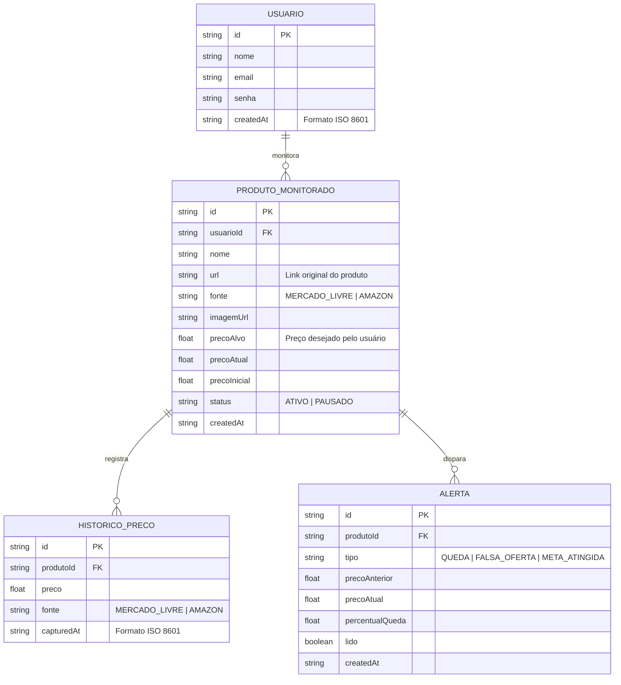

# 🛠️ Especificação Técnica (Tech Spec) - Price Watcher

> **Atenção para IAs (Cursor, Copilot, ChatGPT):** Este documento é a fonte de verdade técnica do projeto. Ao gerar código, utilize **exclusivamente** as versões, classes e métodos especificados abaixo. Não sugira versões alternativas ou APIs diferentes das listadas.

---

## 1. Stack Tecnológica — Versões Exatas

| Camada | Tecnologia | Versão Exata | CDN / Instalação |
|---|---|---|---|
| **Framework CSS** | Bootstrap | `v5.3.3` | `npm i bootstrap@5.3.3` |
| **Ícones** | Bootstrap Icons | `v1.11.3` | `npm i bootstrap-icons@1.11.3` |
| **JavaScript** | ECMAScript | `ES2022 (ES13)` | Nativo no navegador |
| **Gráficos** | Chart.js | `v4.4.3` | `npm i chart.js@4.4.3` |
| **API Fake** | JSON Server | `v0.17.4` | `npm i json-server@0.17.4` |
| **Runtime** | Node.js | `v20.x (LTS)` | [nodejs.org](https://nodejs.org) |
| **Gerenciador de pacotes** | NPM | `v10.x` | Incluso com Node.js |

### 1.1 APIs Públicas Externas

| API | Versão | Base URL | Autenticação |
|---|---|---|---|
| **Mercado Livre API** | `v1` | `https://api.mercadolibre.com` | OAuth 2.0 (Bearer Token) |
| **Amazon PA API** | `v5.0 (PA API 5.0)` | `https://webservices.amazon.com.br/paapi5` | AWS Signature v4 |

### 1.2 CDN para uso direto no HTML (sem NPM)

```html
<!-- Bootstrap v5.3.3 CSS -->
<link rel="stylesheet" href="https://cdn.jsdelivr.net/npm/bootstrap@5.3.3/dist/css/bootstrap.min.css" integrity="sha384-QWTKZyjpPEjISv5WaRU9OFeRpok6YctnYmDr5pNlyT2bRjXh0JMhjY6hW+ALEwIH" crossorigin="anonymous">

<!-- Bootstrap Icons v1.11.3 -->
<link rel="stylesheet" href="https://cdn.jsdelivr.net/npm/bootstrap-icons@1.11.3/font/bootstrap-icons.min.css">

<!-- Chart.js v4.4.3 -->
<script src="https://cdn.jsdelivr.net/npm/chart.js@4.4.3/dist/chart.umd.min.js"></script>

<!-- Bootstrap v5.3.3 JS Bundle (inclui Popper) -->
<script src="https://cdn.jsdelivr.net/npm/bootstrap@5.3.3/dist/js/bootstrap.bundle.min.js" integrity="sha384-YvpcrYf0tY3lHB60NNkmXc4s9bIOgUxi8T/jzmF5wnPY9Td7gJ3+Z5aq4mNqQa3" crossorigin="anonymous"></script>
```

---

## 2. Modelo de Dados (Diagrama ER)

Abaixo está o Diagrama Entidade-Relacionamento (DER) que representa a estrutura do `db.json` e como as entidades se relacionam.



---

## 3. Dicionário de Dados

### `usuarios`
| Campo | Tipo | Descrição |
|---|---|---|
| `id` | String | Gerado automaticamente pelo JSON Server |
| `nome` | String | Nome completo do usuário |
| `email` | String | Usado para login — único no sistema |
| `senha` | String | Em produção, usar hash bcrypt |
| `createdAt` | String | Data de cadastro no formato `YYYY-MM-DDTHH:mm:ssZ` |

### `produtosMonitorados`
| Campo | Tipo | Descrição |
|---|---|---|
| `id` | String | Gerado automaticamente |
| `usuarioId` | String (FK) | Referência ao usuário dono do monitoramento |
| `nome` | String | Nome do produto |
| `url` | String | URL original do produto na loja |
| `fonte` | String | Enum: `"MERCADO_LIVRE"` ou `"AMAZON"` |
| `imagemUrl` | String | URL da imagem do produto |
| `precoAlvo` | Float | Preço limite para disparo de alerta |
| `precoAtual` | Float | Último preço coletado |
| `precoInicial` | Float | Preço no momento do cadastro |
| `status` | String | Enum: `"ATIVO"` ou `"PAUSADO"` |

### `historicosPreco`
| Campo | Tipo | Descrição |
|---|---|---|
| `produtoId` | String (FK) | Chave estrangeira — nomenclatura exigida pelo JSON Server para rotas aninhadas |
| `preco` | Float | Sempre positivo |
| `fonte` | String | Loja de origem da coleta |
| `capturedAt` | String | Timestamp da coleta no formato ISO 8601 |

### `alertas`
| Campo | Tipo | Descrição |
|---|---|---|
| `tipo` | String | Enum: `"QUEDA"`, `"FALSA_OFERTA"` ou `"META_ATINGIDA"` |
| `percentualQueda` | Float | Ex: `15.5` representa queda de 15,5% |
| `lido` | Boolean | Controla se o Toast Bootstrap já foi exibido |

---

## 4. Contratos de API

### 4.1 JSON Server (API Fake — porta 3001)

| Método | Rota | Descrição |
|---|---|---|
| `GET` | `/usuarios` | Lista todos os usuários |
| `POST` | `/usuarios` | Cadastra novo usuário |
| `GET` | `/produtosMonitorados?usuarioId={id}` | Lista produtos de um usuário |
| `POST` | `/produtosMonitorados` | Adiciona produto ao monitoramento |
| `PATCH` | `/produtosMonitorados/{id}` | Atualiza preço atual ou status |
| `DELETE` | `/produtosMonitorados/{id}` | Remove produto do monitoramento |
| `GET` | `/historicosPreco?produtoId={id}` | Retorna histórico de preços |
| `POST` | `/historicosPreco` | Registra novo ponto no histórico |
| `GET` | `/alertas?produtoId={id}&lido=false` | Lista alertas não lidos |
| `PATCH` | `/alertas/{id}` | Marca alerta como lido |

### 4.2 Mercado Livre API v1

**Autenticação:** Bearer Token via OAuth 2.0

```
GET https://api.mercadolibre.com/sites/MLB/search?q={query}&limit=10
Authorization: Bearer {ACCESS_TOKEN}
```

**Campos relevantes do response:**
```json
{
  "results": [{
    "id": "MLB123456",
    "title": "Nome do Produto",
    "price": 299.90,
    "original_price": 399.90,
    "thumbnail": "https://...",
    "permalink": "https://www.mercadolivre.com.br/...",
    "seller": { "nickname": "LOJA_EXEMPLO" }
  }]
}
```

**Regra de negócio:** Se `original_price` existir e for maior que `price`, calcular `percentualQueda = ((original_price - price) / original_price) * 100`. Se `percentualQueda > 30%`, classificar como suspeita de **falsa oferta**.

### 4.3 Amazon PA API v5.0

**Autenticação:** AWS Signature v4 (Header-based)

```
POST https://webservices.amazon.com.br/paapi5/searchitems
Content-Type: application/json; charset=utf-8
X-Amz-Target: com.amazon.paapi5.v1.ProductAdvertisingAPIv1.SearchItems
```

**Payload da requisição:**
```json
{
  "PartnerTag": "{SEU_PARTNER_TAG}",
  "PartnerType": "Associates",
  "Keywords": "{query}",
  "SearchIndex": "All",
  "Resources": [
    "ItemInfo.Title",
    "Offers.Listings.Price",
    "Images.Primary.Medium"
  ]
}
```

---

## 5. Estrutura do Banco de Dados (db.json)

Esta estrutura inicializa a API Fake com dados de exemplo. Ferramentas de IA devem usar este schema como referência para geração de código.

```json
{
  "usuarios": [
    {
      "id": "1",
      "nome": "Augusto Emanuel",
      "email": "augusto@email.com",
      "senha": "senha123",
      "createdAt": "2026-01-10T08:00:00Z"
    }
  ],
  "produtosMonitorados": [
    {
      "id": "1",
      "usuarioId": "1",
      "nome": "Notebook Lenovo IdeaPad 3",
      "url": "https://www.mercadolivre.com.br/...",
      "fonte": "MERCADO_LIVRE",
      "imagemUrl": "https://http2.mlstatic.com/...",
      "precoAlvo": 2500.00,
      "precoAtual": 2799.90,
      "precoInicial": 3199.90,
      "status": "ATIVO",
      "createdAt": "2026-04-01T10:00:00Z"
    }
  ],
  "historicosPreco": [
    {
      "id": "1",
      "produtoId": "1",
      "preco": 3199.90,
      "fonte": "MERCADO_LIVRE",
      "capturedAt": "2026-04-01T10:00:00Z"
    },
    {
      "id": "2",
      "produtoId": "1",
      "preco": 2799.90,
      "fonte": "MERCADO_LIVRE",
      "capturedAt": "2026-04-06T10:00:00Z"
    }
  ],
  "alertas": [
    {
      "id": "1",
      "produtoId": "1",
      "tipo": "QUEDA",
      "precoAnterior": 3199.90,
      "precoAtual": 2799.90,
      "percentualQueda": 12.5,
      "lido": false,
      "createdAt": "2026-04-06T10:00:00Z"
    }
  ]
}
```

---

## 6. Padrões de Código — Referência para IA

### Bootstrap 5.3.3 — Classes obrigatórias no projeto

```html
<!-- Card de produto -->
<div class="card h-100 shadow-sm border-0">
  
  <div class="card-body">
    <h5 class="card-title fs-6 fw-semibold">Nome do Produto</h5>
    <p class="card-text text-success fw-bold fs-5">R$ 299,90</p>
    <span class="badge bg-danger">↓ 12% de queda</span>
  </div>
</div>

<!-- Toast de alerta (Bootstrap 5.3.3) -->
<div class="toast-container position-fixed bottom-0 end-0 p-3">
  <div id="alertToast" class="toast align-items-center text-bg-success border-0" role="alert">
    <div class="d-flex">
      <div class="toast-body">
        <i class="bi bi-bell-fill me-2"></i> Preço atingiu sua meta!
      </div>
      <button type="button" class="btn-close btn-close-white me-2 m-auto" data-bs-dismiss="toast"></button>
    </div>
  </div>
</div>

<!-- Ativar Toast via JS (Bootstrap 5.3.3) -->
<script>
  const toastEl = document.getElementById('alertToast');
  const toast = new bootstrap.Toast(toastEl, { delay: 5000 });
  toast.show();
</script>
```

### Fetch para Mercado Livre API v1

```javascript
async function buscarProdutoML(query, accessToken) {
  const url = `https://api.mercadolibre.com/sites/MLB/search?q=${encodeURIComponent(query)}&limit=10`;
  const response = await fetch(url, {
    headers: { 'Authorization': `Bearer ${accessToken}` }
  });
  if (!response.ok) throw new Error(`ML API Error: ${response.status}`);
  const data = await response.json();
  return data.results;
}
```

### Chart.js v4.4.3 — Gráfico de histórico de preços

```javascript
const ctx = document.getElementById('precoChart').getContext('2d');
new Chart(ctx, {
  type: 'line',
  data: {
    labels: ['01/04', '03/04', '06/04'],
    datasets: [{
      label: 'Histórico de Preço (R$)',
      data: [3199.90, 2999.90, 2799.90],
      borderColor: '#0d6efd',
      backgroundColor: 'rgba(13, 110, 253, 0.1)',
      fill: true,
      tension: 0.4
    }]
  },
  options: {
    responsive: true,
    plugins: { legend: { position: 'top' } }
  }
});
```
